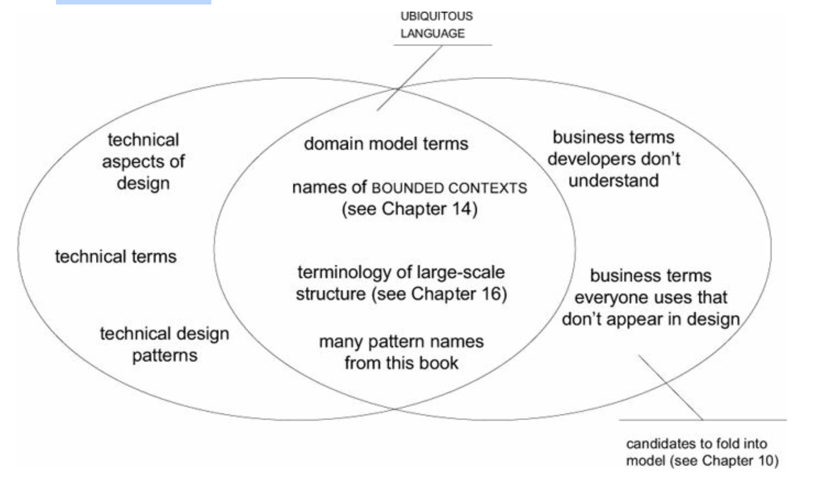
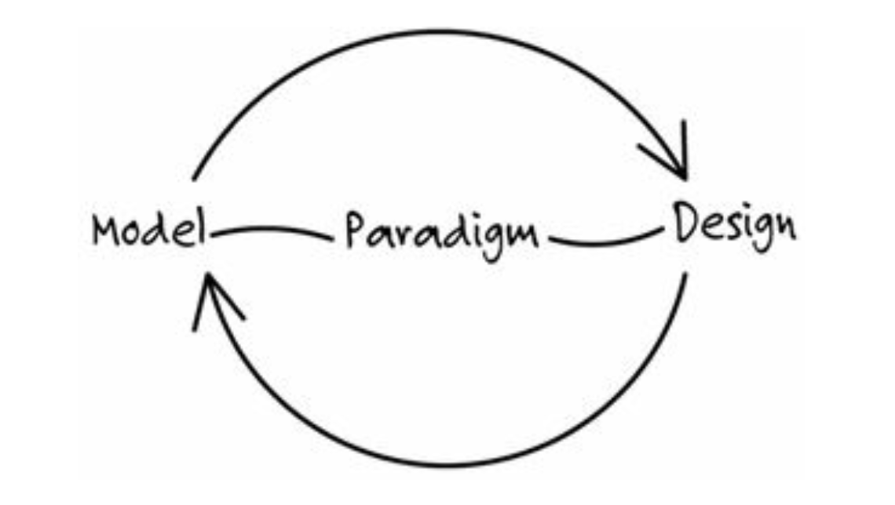

# One.Putting the Domain Model to Work

__Model__: Every model represents some aspect of reality or an idea that is of interest. It is an interpretation of reality that abstracts the aspects relevant to solving the problem at hand and ignores extraneous detail.

__Domain__ :Every software program relates to some activity or interest of its user. That subject area to which the user applies the program is the domain of the software.

A model is a selectively simplified and consciously structured form of knowledge.

A domain model is not a particular diagram; it is the idea that the diagram is intended to convey. it is a rigorously organized and selective abstraction of that knowledge

## The Utility of a Model in Domain-Driven Design
1. __The model and the heart of the design shape each other.__, This binding of model and implementation also helps during maintenance and continuing development
2. __The model is the backbone of a language used by all team members.__
3. __The model is distilled knowledge.__

## The Heart of Software

> The heart of software is its ability to solve domain-related problems for its user.

## Ingredients of Effective Modeling
1. __Binding the model and the implementation.__
2. __Cultivating a language based on the model.__
3. __Developing a knowledge-rich model.__
4. __Distilling the model.__
5. __Brainstorming and experimenting__

It is the creativity of brainstorming and massive experimentation, leveraged through a model-based language and disciplined by the feedback loop through implementation, that makes it possible to find a knowledge-rich model and distill it

> Good programmers will naturally start to abstract and develop a model that can do more work

## Deep Model
Useful models seldom lie on the surface. As we come to understand the domain and the needs of the application, we usually discard superficial model elements that seemed important in the beginning, or we shift their perspective

> Knowledge crunching is an exploration, and you can’t know where you will end up.

# Two. Communication and the Use of Language
A domain model can be the core of a common language for a software project. The model is a set of concepts built up in the heads of people on the project, with terms and relationships that reflect domain insight.

A project faces serious problems when its language is fractured. Domain experts use their jargon while technical team members have their own language tuned for discussing the domain in terms of design.

Translation blunts communication and makes knowledge crunching anemic.
A project needs a common language that is more robust than the lowest common denominator

The vocabulary of that UBIQUITOUS LANGUAGE includes the names of classes and prominent operations. The LANGUAGE includes terms to discuss rules that have been made explicit in the model.

The model relationships become the combinatory rules all languages have. The meanings of words and phrases echo the semantics of the model.

Committed to using this language in the context of implementation, the developers will point out imprecision or contradictions, engaging the domain experts in discovering workable alternatives.

Recognize that a change in the UBIQUITOUS LANGUAGE is a change to the model.

The UBIQUITOUS LANGUAGE is the primary carrier of the aspects of design that don’t appear in code—large- scale structures that organize the whole system, BOUNDED CONTEXTS that define the relationships of different systems and models, and other patterns applied to the model and design.

Play with the model as you talk about the system. Describe scenarios out loud using the elements and interactions of the model, combining concepts in ways allowed by the model. Find easier ways to say what you need to say, and then take those new ideas back down to the diagrams and code.

If sophisticated domain experts don’t understand the model, there is something wrong with the model.

## Documents and Diagrams
Some people are naturally visual, and diagrams help people grasp certain kinds of information. \
Diagrams are a means of communication and explanation, and they facilitate brainstorming.They show design constraints, but they are not design specifications in every detail. They represent the skeletons of ideas.

__The vital detail about the design is captured in the code.__ A well-written implementation should be transparent, revealing the model underlying it.

Always remember that the model is not the diagram. The diagram’s purpose is to help communicate and explain the model.

__Documents Should Complement Code and Speech.__

__Documents Should Work for a Living and Stay Current__

__A document must be involved in project activities__

The greatest value of a design document is to explain the concepts of the model, help in navigating the detail of the code, and perhaps give some insight into the model’s intended style of use.

The UBIQUITOUS LANGUAGE allows other documents, such as requirements specifications, to be more concise and less ambiguous

# Three. Binding Model and Implementation
Models come in many varieties and serve many roles, even those restricted to the context of a software development project. Domain-driven design calls for a model that doesn’t just aid early analysis but is the very foundation of the design

On the other hand, many complex projects do attempt some sort of domain model, but they don’t maintain a tight connection between the model and the code. The model they develop, possibly useful as an exploratory tool at the outset, becomes increasingly irrelevant and even misleading. All the care lavished on the model provides little reassurance that the design is correct, because the two are different. The result is that pure analysis models get abandoned soon after coding starts, and most of the ground has to be covered again. But the second time around, if the developers perceive analysis to be a separate process, modeling happens in a less disciplined way. 

Whatever the cause, software that lacks a concept at the foundation of its design is, at best, a mechanism that does useful things without explaining its actions.

An analysis must capture fundamental concepts from the domain in a comprehensible, expressive way.

__MODEL-DRIVEN DESIGN__ discards the dichotomy of analysis model and design to search out a single model that serves both purposes.

There are always many ways of abstracting a domain, and there are always many designs that can solve an application problem. This is what makes it practical to bind the model and design.

The imperative to relate the domain model closely to the design adds one more criterion for choosing the more useful models out of the universe of possible models. It calls for hard thinking and usually takes multiple iterations and a lot of refactoring, but it makes the model relevant.

Revisit the model and modify it to be implemented more naturally in software, even as you seek to make it reflect deeper insight into the domain. Demand a single model that serves both purposes well, in addition to supporting a robust UBIQUITOUS LANGUAGE.

To make a MODEL-DRIVEN DESIGN pay off, the correspondence must be literal, exact within bounds of human error. To make such a close correspondence of model and design possible, it is almost essential to work within a modeling paradigm supported by software tools that allow you to create direct analogs to the concepts in the model.

### Letting the Bones Show: Why Models Matter to Users

MODEL-DRIVEN DESIGN calls for working with only one model. 

Manufacturing is a popular metaphor for software development. One inference from this metaphor: highly skilled engineers design; less skilled laborers assemble the products. This metaphor has messed up a lot of projects for one simple reason—software development is all design. All teams have specialized roles for members, but overseparation of responsibility for analysis, modeling, design, and programming interferes with MODEL-DRIVEN DESIGN.

__First__, some of the model’s intent was lost in the handoff. The overall effect of a model can be very sensitive to details, and those details don’t always come across in a UML diagram or a general discussion. 

__Second__ problem was the indirectness of feedback from the interaction of the model with the implementation and the technology.

If the people who write the code do not feel responsible for the model, or don’t understand how to make the model work for an application, then the model has nothing to do with the software.

Any technical person contributing to the model must spend some time touching the code, whatever primary role he or she plays on the project. Anyone responsible for changing code must learn to express a model through the code. Every developer must be involved in some level of discussion about the model and have contact with domain experts. Those who contribute in different ways must consciously engage those who touch the code in a dynamic exchange of model ideas through the UBIQUITOUS LANGUAGE.