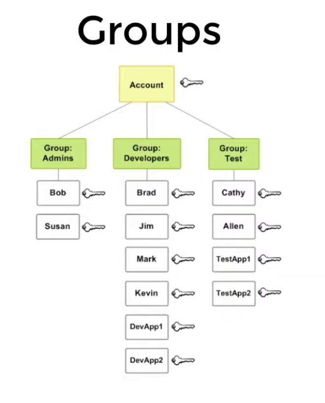

# IAM 
IAM provides the infrastructure necessary to control authentication and authorization for your account


IAM stands for Identify and Access Management 
* Control Access to Resources 
* Resources are our services 
* Users attempt to perform **actions** like _Storage::Bucket::Create_
* Authorization to perform an Action Depends on a **Policy**

## Terms 
**IAM Resources:**
    The user, group, role, policy, and identity provider objects that are stored in IAM. As with other AWS services, you can add, edit, and remove resources from IAM.

**IAM Identities:**
    The IAM resource objects that are used to identify and group. You can attach a policy to an IAM identity. These include users, groups, and roles.

**IAM Entities:**
    The IAM resource objects that AWS uses for authentication. These include IAM users and roles.

**Principals:**
    A person or application that uses the AWS account root user, an IAM user, or an IAM role to sign in and make requests to AWS. Principals include federated users and assumed roles.

## Policy Statement Example 
```jsonc
{
    "Version": "2022-02-01",
    "Statement": [
        {
            "Sid": "ReadOnlyAccess",    // criteria of access
            "Effect": "Allow",          // access type -> Deny, Allow
            "Action": [
                "dynamodb:BatchGet*",    // using wild card
                "dynamodb:GetItem"
            ],
            "Resources": "arn:aws:dynamodb:*:*:table/MyTable",
            "Condition": {
                "ForAllValues:StringEquals":  {
                    "dynamodb:Attributes": [
                        "Column-1",
                        "Column-2"
                    ]
                }
            }
        }
    ]
}
``` 

## Concepts
**User:** Specific Individuals 

**Group:** collections of users; you can access to pre defined permissions  


**Roles:** Collections Of policies, You can give specific Permissions to a certain user 

**Policies/Permissions:** Allow, Deny
